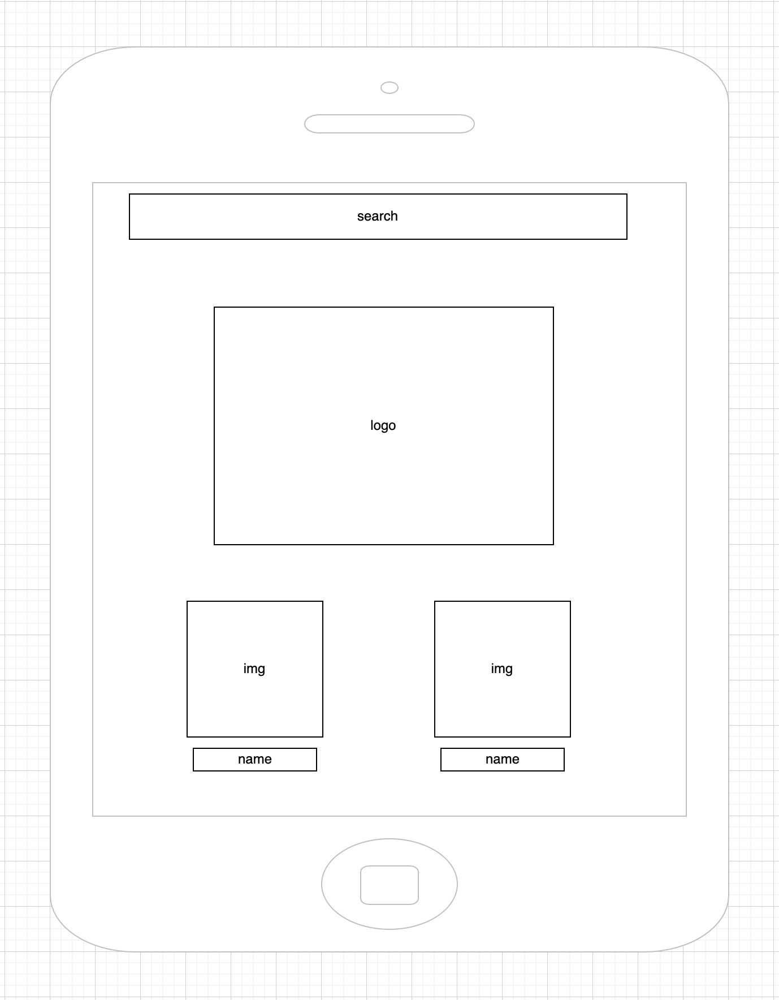
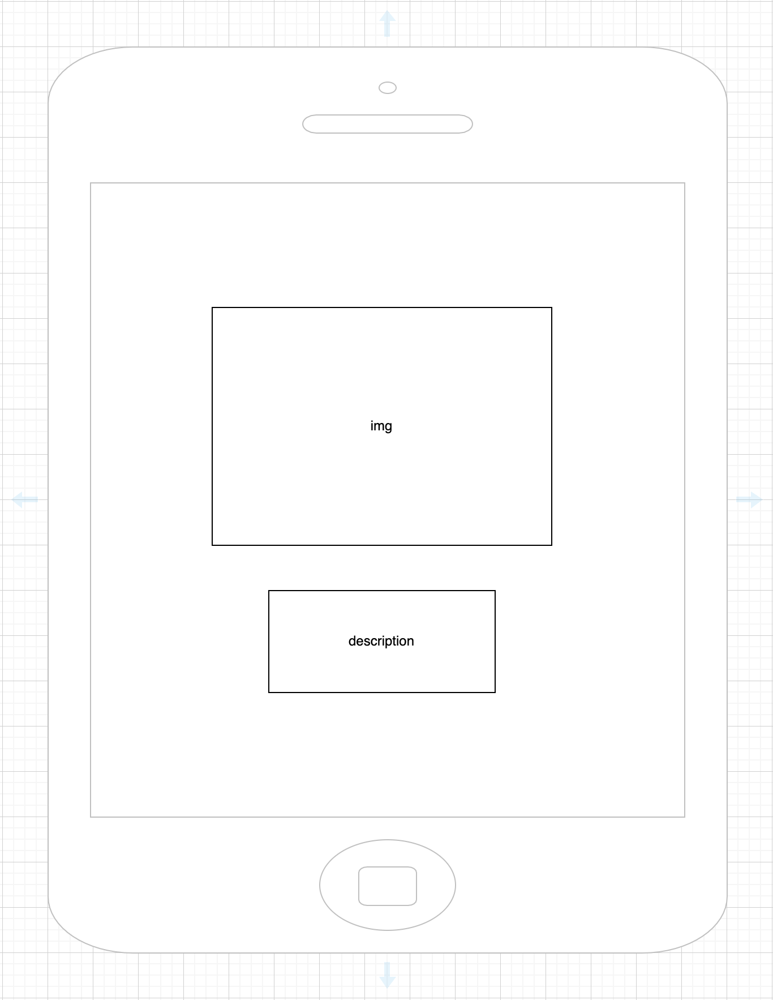
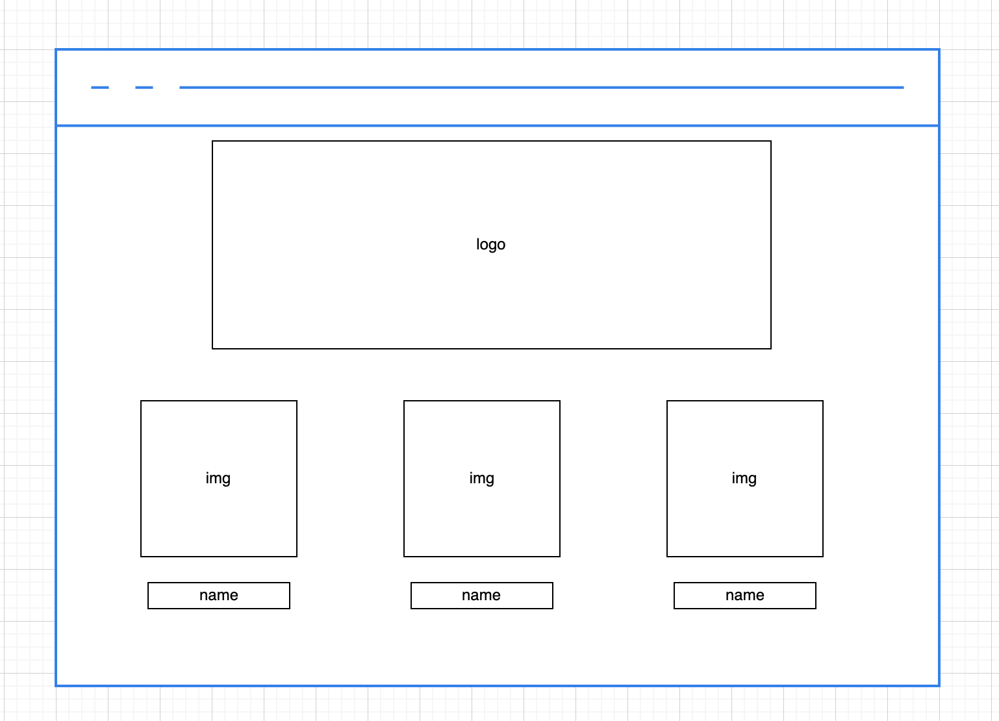
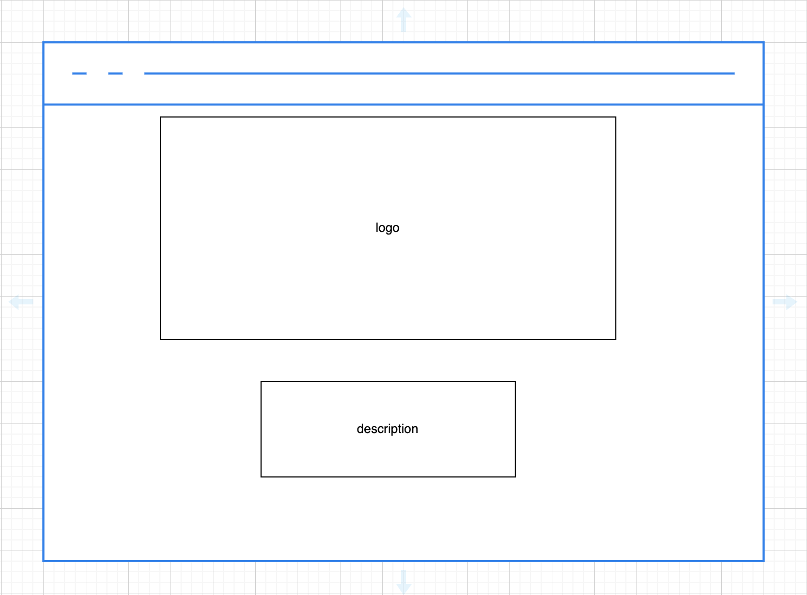
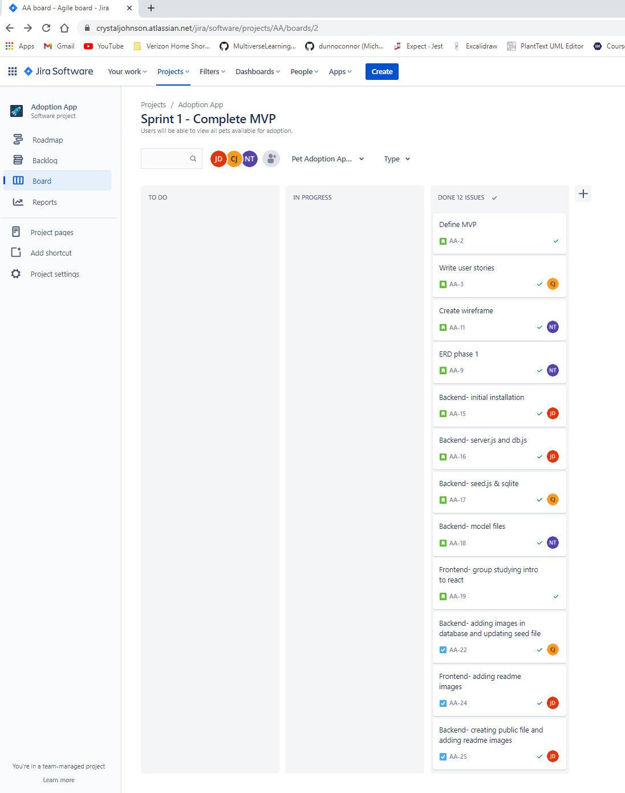
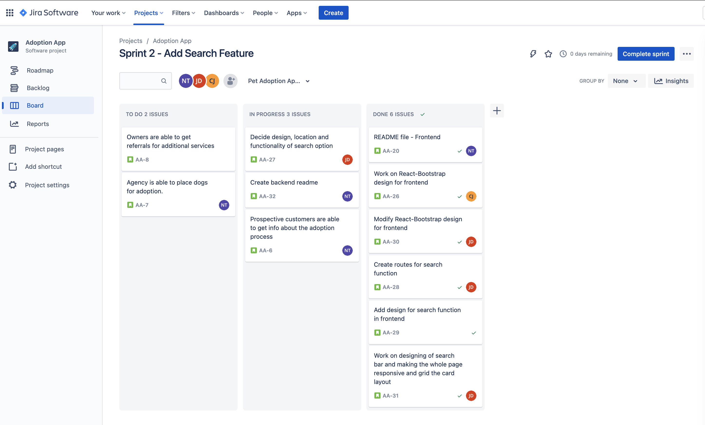

# NCIJ-Pet-Adoptions -- Frontend

  
# Project goals: 
Create a React App that allows users to view dogs available for adoption.  Users are able to:
<ol>
<li>View the photos of the dogs available for adoption.</li>
<li>Search for dogs on the app.</li>
<li>Get dog details: Name, Purpose, Breed, Color, Size and Gender.</li>
<li>Get information about the adoption process.</li>
</ol>

# Technologies Used for the Frontend:
<ul>
<li>React</li>
<li>Javascript</li>
<li>Bootstrap</li>
<li>React-Bootstrap</li>
<li>HTML</li>
<li>CSS</li>  
</ul>

# Project Planning (Agile method)                                                            
<ul>
<li>Jira</li>
<li>Draw.io</li>
</ul>
    
    
# Getting Started
Started with an initial plan where we put our various ideas together on a google doc. Created an organization with two repositories (Backend & Frontend). Frontend for React (user input) and Backend for hard coding (database). Initialized and installed tools as well as relevant dependencies. Revised scripts in package.json. Created development branches and testing environments. Created sprints to enable a smooth project planning in Jira. Established the wireframes with draw.io. Distributed tasks between team members.

  <pre>               Phone landing page                                                Dog detail page  </pre>
  

    
    

   
   <pre>               Computer landing page                                             Dog detail page  </pre>

   

  
  <pre>           Agile / Kanban board / Sprint1                                 Agile / Kanban board / Sprint2  </pre>

   

# Production
The planning process for NJIC-Pet-Adoptions at the frontend consisted of: 
- Each team member did Daily Standup meetings before we started work for that day and Daily Exit Tickets at the end of the day. This was in rotation.
- Individually and still as a group worked on our assigned tasks.
- Watched class recordings together to better understand certain concepts for a better realization of our project.
- Built a solid backend then worked on the frontend structures.
- Handled debuggings and other issues that came up.

# Helpful Resouces
- [React-Bootstrap](https://www.google.com/search?q=react+bootstrap&rlz=1C5GCEM_enUS979US980&oq=react+boostrap&aqs=chrome.1.69i57j0i10i131i433l2j0i10i433j0i10i131i433l2j0i10j0i10i131i433l2j0i10.4768j0j15&sourceid=chrome&ie=UTF-8)
- [Stack Overflow](https://www.google.com/search?q=stack+overflow&rlz=1C5GCEM_enUS979US980&ei=cy_EYamXBOnD_Qa6qpTQCw&oq=stac&gs_lcp=Cgdnd3Mtd2l6EAEYADIHCAAQsQMQQzIHCAAQsQMQQzIICC4QgAQQsQMyCAguEIAEELEDMggIABCABBCxAzILCC4QgAQQxwEQrwEyCAguEIAEELEDMggIABCABBCxAzIECAAQQzIECAAQQzoFCAAQgAQ6BQguEIAEOggILhCxAxCDAToOCC4QgAQQsQMQxwEQ0QM6CwguEIAEEMcBENEDOgsIABCABBCxAxCDAToOCC4QgAQQsQMQxwEQowI6CAgAELEDEIMBOgsIABCABBCxAxDJAzoFCAAQkgNKBAhBGABKBAhGGABQAFjwB2DkGGgAcAJ4AIAB4wKIAbUGkgEHMC4yLjEuMZgBAKABAcABAQ&sclient=gws-wiz)
- [Pexels](https://www.pexels.com/)
- [Unsplash](https://unsplash.com/)
- [YouTube](https://www.google.com/search?q=youtube&rlz=1C5GCEM_enUS979US980&ei=4y_EYaCSH6ivggfj05yYCA&ved=0ahUKEwjgj-Wdvfn0AhWol-AKHeMpB4MQ4dUDCA4&uact=5&oq=youtube&gs_lcp=Cgdnd3Mtd2l6EAMyEQguEIAEELEDEIMBEMcBENEDMgUIABCABDIICAAQgAQQsQMyCAgAEIAEELEDMggIABCABBCxAzIECAAQAzIICAAQgAQQsQMyCAgAEIAEELEDMgsIABCABBCxAxCDATIICAAQgAQQsQM6BQgAEJECOggILhCABBCxAzoLCC4QgAQQsQMQgwE6CwguEIAEEMcBEK8BOggIABCxAxCDAToFCC4QgAQ6CwguEIAEEMcBENEDOgcILhCxAxBDOgQIABAKOgcIABCxAxAKOgQILhAKOhMILhCxAxCDARCxAxDHARDRAxAKOgYIABAKEAM6CggAELEDEIMBEAo6EAguELEDEIMBEMcBENEDEApKBAhBGABKBAhGGABQAFjQM2CwOmgGcAJ4AIABwQKIAYcRkgEHMS45LjIuMZgBAKABAcABAQ&sclient=gws-wiz)

# Team members
<ol>
<li>Jannatul Diba</li>
<li>Crystal Johnson</li>
<li>Irene Bowers</li>
<li>Nadege Tenku</li>
</ol>
